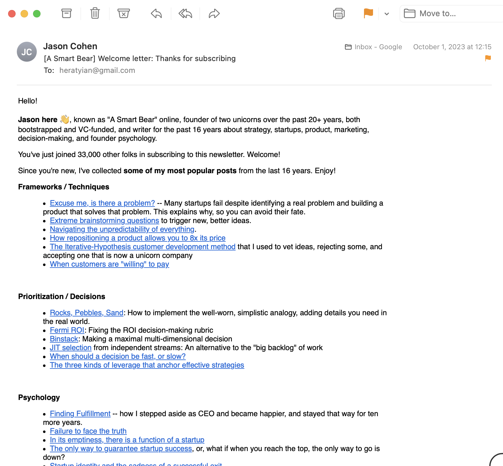
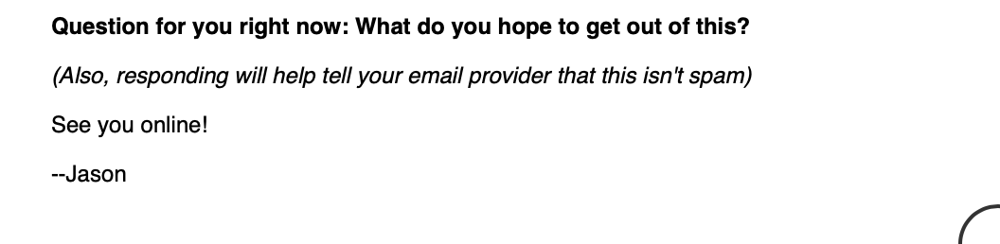
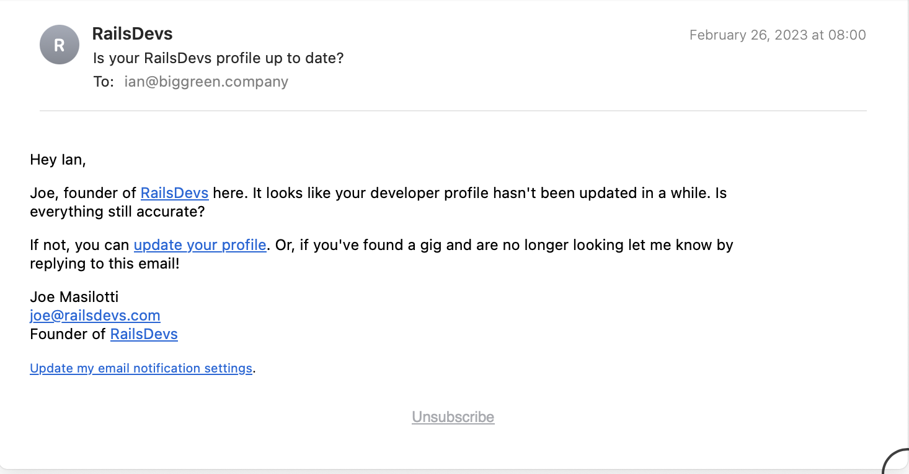

> "If I had asked people what they wanted, they would have said faster horses."
>
> -Henry Ford

---


- Best developers maintain a direct connection to users.
- Conversely, it is often a bad sign if developers do not encounter *any* user feedback

<!-- 
- wufoo/37signals have developers take customer support calls once a week/month
 -->
---
# Product development lifecycle

1. Idea 💡
2. Launch something 🚀
3. Talk to users to see if it serves their needs 🗣️
4. Repeat 🔁

---

> "A lot of times, people don’t know what they want until you show it to them."
> 
> —Steve Jobs


<!--
this does NOT mean don't talk to users

DON'T BE FAKE STEVE JOBS

Talk to as many users as you can
-->
---

- Listen to what users say, but more importantly, **focus on what they do**.
<!-- - Listen for user problems (You can usually ignore their proposed solutions) -->
- If a user is "hacking" your product in a way you didn't expect, double down on that.

<!-- users own the problem, you own the solution -->
---
# The Mom Test


- How to talk to both current and potential users
- How to run a great user interview
- How to interpret the feedback in these conversations

[source](https://www.momtestbook.com/)


---

# A useful conversation

- Talk about their life, not your idea.
- Talk specifics, not hypotheticals.
- Listen, don’t talk.


---

# Guidelines

- Ask about someone’s behavior, not hypotheticals.
- People will lie to you. It’s your job to make sure they don’t by asking correct questions.
- Questions you ask should terrify you. They could disprove what you’re researching.

---

# Bad Questions vs Good Questions

| Bad Question | Good Question |
| --- | --- |
| Do you think it’s a good idea? | Why do you bother? |
| Would you buy a product which did X? | What are the implications of that? Talk me through your workflow. |
| How much would you pay for X?	| What else have you tried? |
| What would your dream product do?	| How are you dealing with it now? |
| Would you pay X for a product that did Y?	| Who else should I talk to? |
| Do you think your husband would use this?	| Is there anything else I should have asked? |

---

# Five Great Interview Questions
- What is the hardest part about [doing this thing]?
- When is the last time you encountered this problem?
- Why was this hard?
- What, if anything, have you done to solve this problem?
- What don’t you love about the solution you already tried?

---

# Types of Bad Data
- Compliments
- Fluff (generics, hypotheticals, and the future)
- Ideas

---

# Keep it casual

- User interviews can be really casual.
- They might not even know about your product!

> "don't think up ideas, notice ideas"

---
# Scenario 1

You are working on a solution for improving the work commute. Work together in groups to come up with questions you can ask commuters.

- **User Profile**: People who travel to get to work
- **Pain Point**: Many commuters find their commute stressful, crowded, and unpredictable

<!-- The objective is to explore potential improvements to the commuting experience without presuming a specific solution. Encourage students to think about how they can get detailed, actionable insights that go beyond surface-level compliments, complaints or desires. -->

---
# Scenario 2

You are working on a solution to enhance the grocery shopping experience. Work together in groups to come up with questions you can ask grocery shoppers.

- **User Profile**: Individuals responsible for grocery shopping in their household.
- **Pain Point**: Shoppers often find grocery shopping to be time-consuming, challenging to stay within budget, and difficult to find everything they need due to stock issues or store layout complexities.

---

# Scenario 3

You are working on a solution to optimize home workout routines. Work together in groups to come up with questions you can ask people who workout at home.

- **User Profile**: Individuals looking to maintain or improve their fitness at home, ranging from beginners to those with intermediate experience.
- **Pain Point**: Many find it challenging to stay motivated, create a consistent workout routine, or know the right exercises to meet their fitness goals while at home. Others may struggle with limited space or lack of equipment.

---

# Eat Your Own Dog Food


- "dog fooding"
- Use your own product to experience it as your users do
- If it's good enough for you, it's probably also good enough for your users

---
# Add a way for users to contact you!

- contact link in footer to send an email

```html
<a href="mailto:ian@dpi.dev>Email Me</a>
```

- You can even add a `body` and `subject` as query string params
- This works for SMS too

```html
<a href="sms:+15555555555>Text Me</a>
```

---

# Send user registration email follow up
- Make sure you have a way to contact users
  - confirm email and/or phone number
- Welcome your new users when they sign up

```ruby
class User < ApplicationRecord
  after_create :send_welcome_email

  private

  def send_welcome_email
    UserMailer.welcome_email(self).deliver_now
  end
end
```

---



---



---



---

# TLDR;

Don’t Ask Anyone Whether Your App Is A Good Idea!

---

# Resources

[Mom Test Summary](https://nucks.co/notes/the-mom-test-rob-fitzpatrick)
[How To Talk To Users | Startup School](https://www.youtube.com/watch?v=z1iF1c8w5Lg)
[Eric Migicovsky - How to Talk to Users](https://www.youtube.com/watch?v=MT4Ig2uqjTc)

